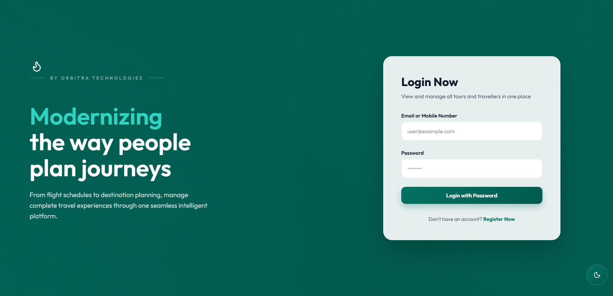
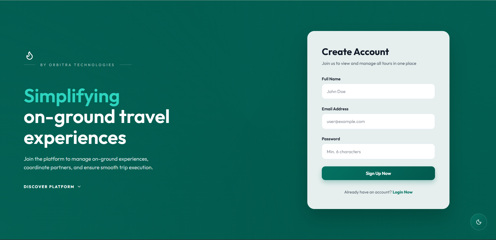
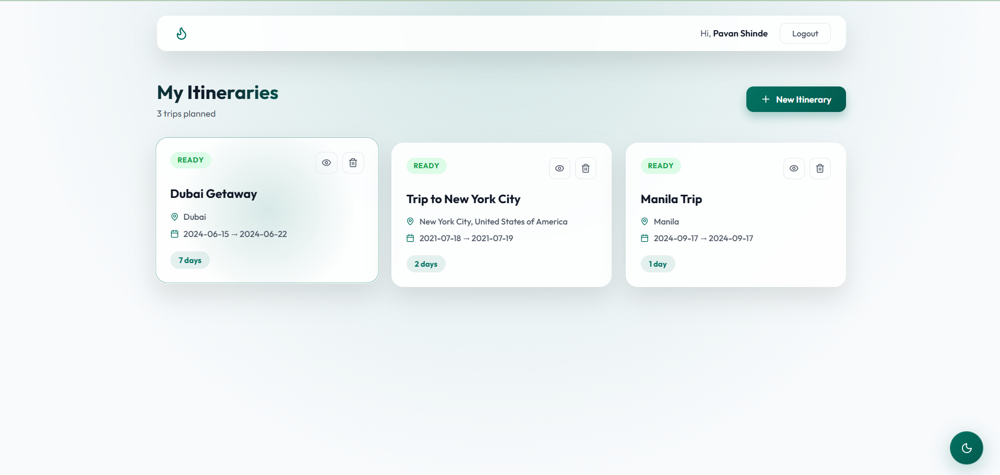
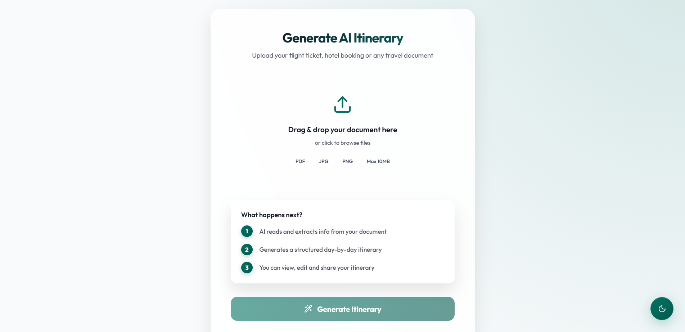
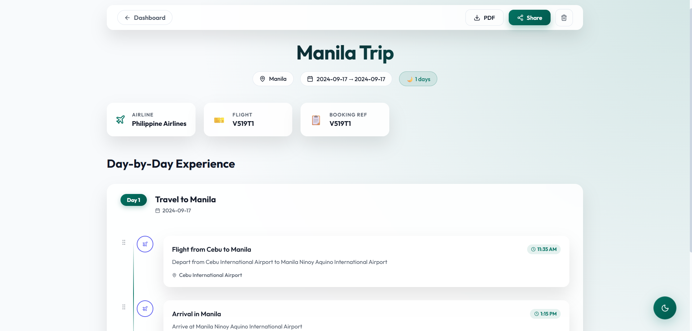
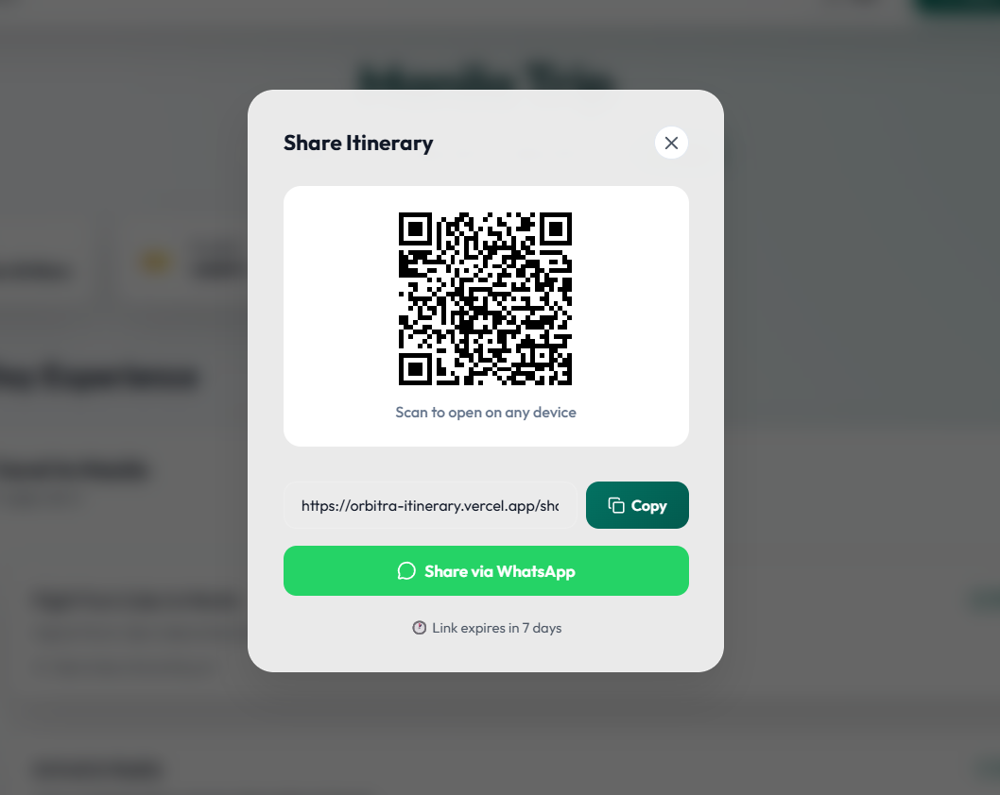

# ✈️ TripCraft Itinerary Generator

> AI-powered travel itinerary generator — upload your flight ticket or hotel booking and get a complete day-by-day itinerary instantly.


---

## 🔗 Links

| | |
|---|---|
| 🌐 **Live Demo** | https://tripcraft-itinerary.vercel.app |
| 📦 **GitHub Repo** | https://github.com/PavanShinde412/tripcraft-itinerary |
| 🔧 **Backend API** | https://tripcraft-itinerary.onrender.com/api/health |

---
## 📸 Screenshots

### Login


### Register


### Dashboard


### Upload & Generate


### Itinerary Detail


### Share


---

## ✨ Features

### Core Features
- 🔐 **JWT Authentication** — Secure register/login with bcrypt password hashing
- 📄 **Document Upload** — Supports PDF and image (JPG, PNG) travel documents
- 🤖 **AI Extraction** — Extracts flight, hotel, dates and passenger info automatically
- 🗓️ **Itinerary Generation** — Structured day-by-day itinerary using Groq LLaMA 3.3
- 💾 **History** — All itineraries stored in MongoDB, accessible anytime
- 🔗 **Smart Sharing** — Unique share token + QR code + copy link + 7-day expiry
- 📱 **Responsive UI** — Works on mobile, tablet and desktop

### Bonus Features
- 🖱️ **Drag & Drop** — File upload with react-dropzone
- 📊 **Status Tracking** — Processing / Completed / Failed states
- 🌙 **Dark Mode Toggle** — Theme switcher
- 🔒 **Revoke Share Link** — Disable sharing anytime
- 🛡️ **Security** — Helmet.js, CORS, rate limiting ready

---

## 🛠️ Tech Stack

### Frontend
| Technology | Purpose |
|---|---|
| React 18 | UI framework |
| React Router v6 | Client-side routing |
| Axios | HTTP client with interceptors |
| react-dropzone | Drag & drop file upload |
| react-hot-toast | Toast notifications |
| lucide-react | Icons |
| qrcode.react | QR code generation |

### Backend
| Technology | Purpose |
|---|---|
| Node.js + Express | REST API server |
| MongoDB + Mongoose | Database + ODM |
| JWT + bcryptjs | Authentication |
| Multer | File upload handling |
| pdf-parse | PDF text extraction |
| Groq SDK (LLaMA 3.3) | AI itinerary generation |
| Helmet + CORS | Security middleware |
| Morgan | HTTP request logging |
| UUID | Share token generation |

### Infrastructure
| Service | Purpose |
|---|---|
| Vercel | Frontend deployment |
| Render | Backend deployment |
| MongoDB Atlas | Cloud database |
| cron-job.org | Keep backend alive |

---

## 📁 Folder Structure

```
tripcraft-itinerary/
│
├── client/                          # React Frontend
│   └── src/
│       ├── api/
│       │   └── axios.js             # Axios instance + interceptors
│       ├── context/
│       │   └── AuthContext.js       # Global auth state
│       ├── pages/
│       │   ├── Login.js             # Login page
│       │   ├── Register.js          # Register page
│       │   ├── Dashboard.js         # Itinerary history
│       │   ├── Upload.js            # File upload + generation
│       │   ├── ItineraryDetail.js   # Full itinerary view + share
│       │   └── ShareView.js         # Public shared itinerary
│       └── App.js                   # Routes + auth guard
│
└── server/                          # Node.js Backend
    ├── controllers/
    │   ├── authController.js        # register, login, getMe
    │   └── itineraryController.js   # upload, generate, CRUD, share
    ├── middleware/
    │   ├── authMiddleware.js        # JWT protect middleware
    │   └── errorHandler.js         # Global error handler
    ├── models/
    │   ├── User.js                  # User schema + password hashing
    │   └── Itinerary.js            # Itinerary schema with sub-schemas
    ├── routes/
    │   ├── authRoutes.js           # /api/auth/*
    │   └── itineraryRoutes.js      # /api/itinerary/*
    ├── services/
    │   ├── aiService.js            # Groq AI generation
    │   └── extractionService.js    # PDF/image extraction
    ├── utils/
    │   └── responseHelper.js       # Consistent API responses
    └── server.js                   # Express app entry point
```

---

## 🚀 API Endpoints

### Auth
| Method | Endpoint | Description | Auth |
|---|---|---|---|
| POST | `/api/auth/register` | Register new user | ❌ |
| POST | `/api/auth/login` | Login user | ❌ |
| GET | `/api/auth/me` | Get current user | ✅ |

### Itinerary
| Method | Endpoint | Description | Auth |
|---|---|---|---|
| POST | `/api/itinerary/upload` | Upload doc + generate itinerary | ✅ |
| GET | `/api/itinerary` | Get all my itineraries | ✅ |
| GET | `/api/itinerary/:id` | Get single itinerary | ✅ |
| DELETE | `/api/itinerary/:id` | Delete itinerary | ✅ |
| POST | `/api/itinerary/:id/share` | Generate share link | ✅ |
| DELETE | `/api/itinerary/:id/share` | Revoke share link | ✅ |
| GET | `/api/itinerary/share/:token` | View shared itinerary | ❌ |

### Response Format
```json
// Success
{ "success": true, "data": { ... } }

// Error
{ "success": false, "error": "message" }
```

---

## ⚙️ Local Setup

### Prerequisites
- Node.js v18+
- MongoDB (local or Atlas)
- Groq API key (free at console.groq.com)

### 1. Clone the repo
```bash
git clone https://github.com/PavanShinde412/tripcraft-itinerary.git
cd tripcraft-itinerary
```

### 2. Setup Backend
```bash
cd server
npm install
```

Create `server/.env`:
```env
PORT=5000
MONGO_URI=mongodb://localhost:27017/tripcraft
JWT_SECRET=your_jwt_secret_here
JWT_EXPIRE=7d
GROQ_API_KEY=your_groq_api_key_here
NODE_ENV=development
CLIENT_URL=http://localhost:3000
```

```bash
npm run dev
```

### 3. Setup Frontend
```bash
cd client
npm install
npm start
```

Open http://localhost:3000

---

## 🗄️ Database Schema

### User
```js
{
  name: String,
  email: String (unique),
  password: String (hashed),
  createdAt: Date,
  updatedAt: Date
}
```

### Itinerary
```js
{
  userId: ObjectId,
  title: String,
  destination: String,
  startDate: String,
  endDate: String,
  duration: Number,
  summary: {
    airline, flightNumber, hotel,
    totalTravelers, bookingReference
  },
  days: [{
    day, date, title, accommodation,
    notes, activities: [{
      time, title, description,
      location, type
    }]
  }],
  sourceFiles: [{ originalName, mimetype, size, path }],
  shareToken: String (unique),
  isPublic: Boolean,
  shareExpiry: Date,
  status: enum['processing', 'completed', 'failed'],
  createdAt: Date
}
```

---

## 🔄 How It Works

```
User uploads PDF/Image
        ↓
Multer saves file locally
        ↓
pdf-parse extracts text (PDF)
OR base64 encode (Image)
        ↓
Groq LLaMA 3.3 processes text
with structured prompt
        ↓
AI returns JSON itinerary
        ↓
Saved to MongoDB
        ↓
Displayed to user
        ↓
User can share via
QR code / link / WhatsApp
```

---

## 👨‍💻 Author

**Pavan Shinde**
- GitHub: [@PavanShinde412](https://github.com/PavanShinde412)
- Assignment for: Orbitra Technologies — Junior Full Stack Developer (MERN + AI)

---

## 📄 License

MIT License — feel free to use this project for learning purposes.